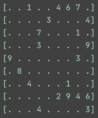

# SudokuSolver
An app to solve Sudoku Puzzles

## Task:
Create a Sudoku board and use backtracking to solve it

## Criteria:
* Stick to the rules of Sudoku
* Offer a customizable table that goes beyond the 9x9 square
* Provide a GUI for the user
* Display graphics in order for algorithm to be visualized

### Prototype #1:
Made the already solved board and deleted spaces for the algorithm to solve.

### Prototype #2:
Implemented the backtracking in order to solve the puzzle in the console.

