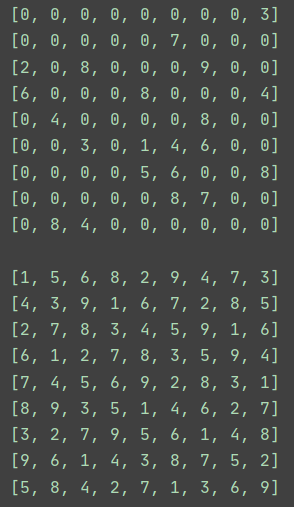
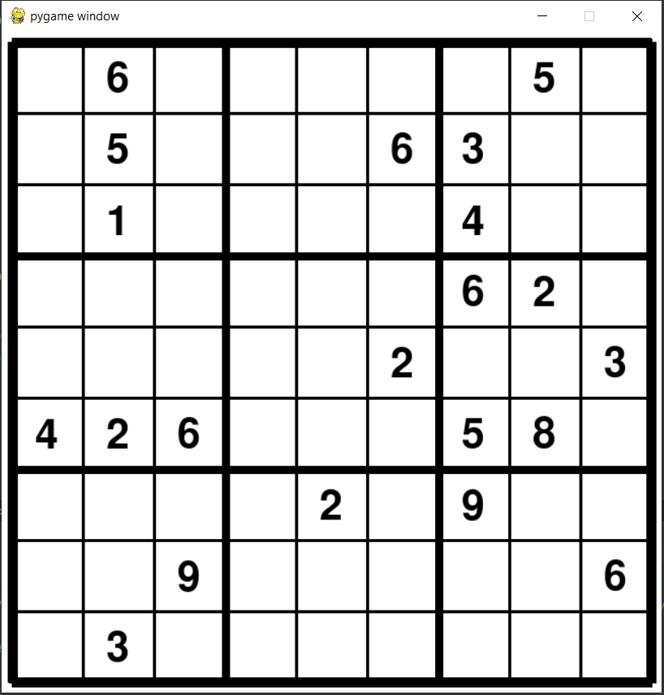
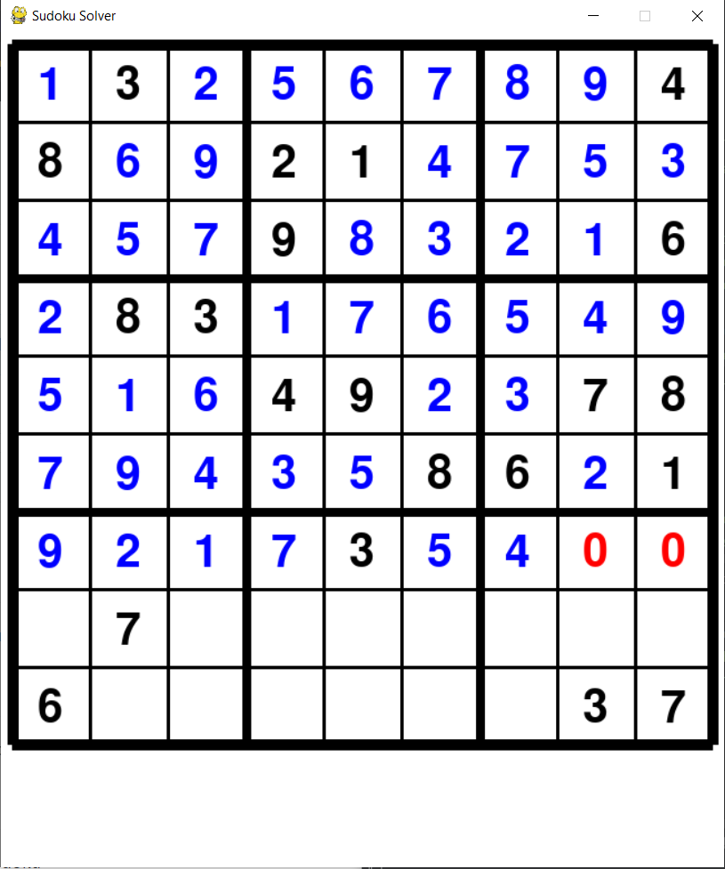
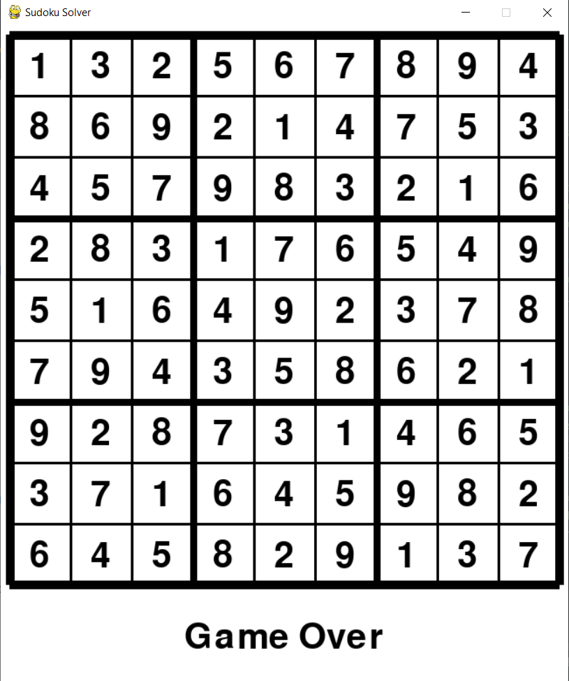

# SudokuSolver
An app to solve Sudoku Puzzles

## Task:
Create a Sudoku board and use backtracking to solve it

## Criteria:
* Stick to the rules of Sudoku
* Offer a randomized table that differs each time it is run
* Provide a GUI for the user
* Display graphics in order for algorithm to be visualized

## How to Use App
1. After files are downloaded, the user should click run and see a pop up Pygame window.
2. The User can press "1" on the keyboard to activate backtracking algorithm.
3. Once puzzle is solved, a message saying "Game Over" will appear and app can be exited.

### Prototype #1:
Implemented the backtracking in order to solve the puzzle in the console.

### Prototype #2:
Included a GUI that only displays the partially filled sudoku board.

## Final Product:
Project meets criteria while still remaining visually pleasing to watch. Below are some examples of how the app works.

Partially solved:

Completely solved:

